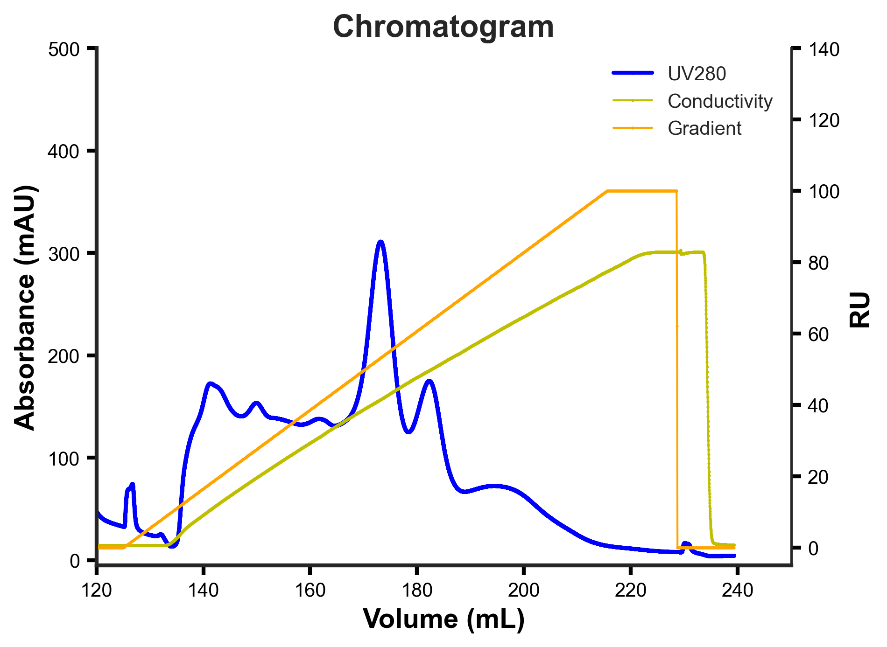

This little python script creates a plot based on a raw data .csv file that ones gets after an Äkta run for example. 
As an example we added some data from IEX run, feeding the script simply with the csv-file_path x and y_limits as well as a title.

The following was created with the following additional arguments: --x_limits 120 240 --y_limits 0 500 --title Chromatogram

  

The limits for the second Y-axis in the plot (RU) are enbeded in the script and would need manual adjustment in case those need to be changed, but usually the gradient and conductivity don't exceed a limit of 100.
