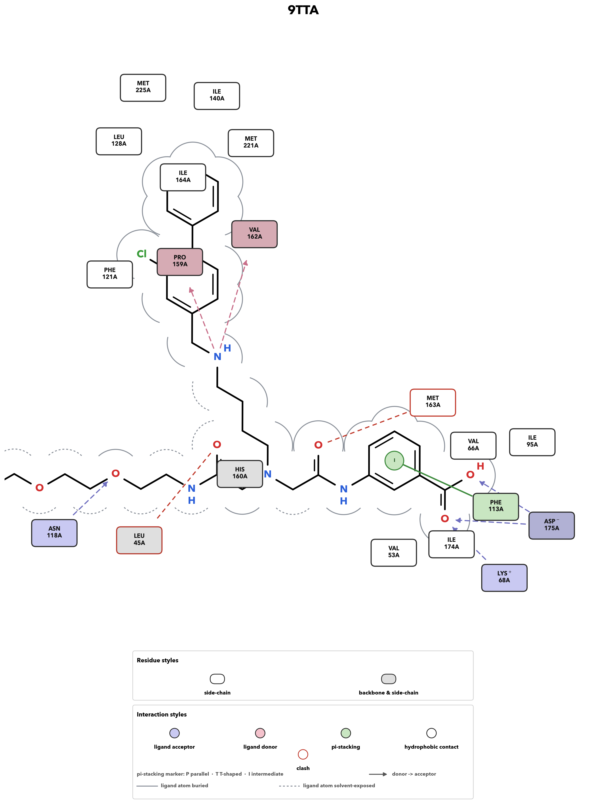
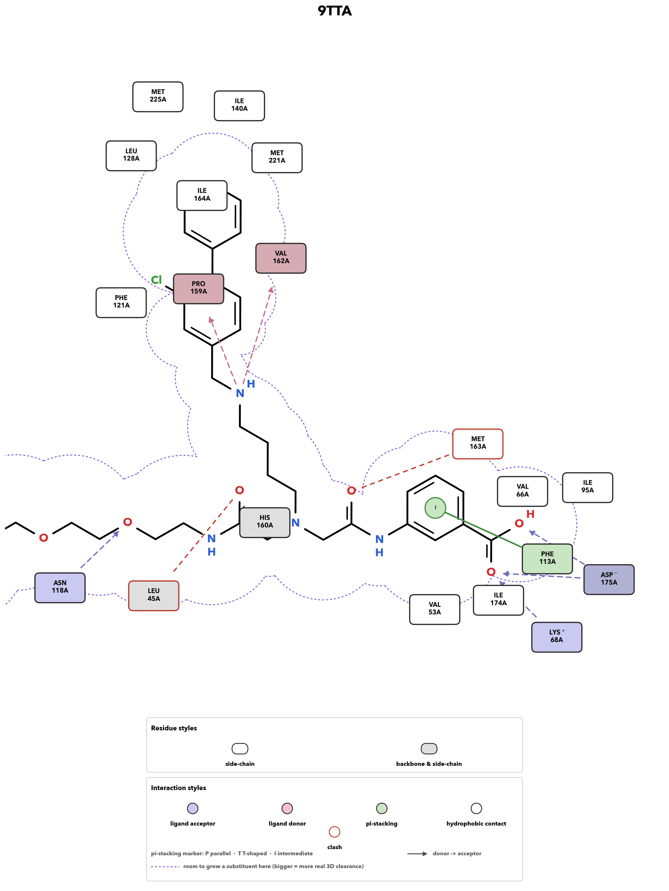

# protein-ligand-interactions

Open-source protein-ligand interaction analysis and 2D diagrams, a free
alternative to commercial tools (OpenEye, Schrodinger) for the everyday task
of "what is this ligand touching, and can I get a clean 2D picture of it".

Built entirely on Biopython, RDKit, NumPy/SciPy and matplotlib. No commercial
toolkit or license required. PyMOL is used only as an optional 3D renderer.

<p align="center">
  
</p>

## What it does

Two independent command-line tools, both working directly from a `.cif`/`.pdb`
structure file:

- **`protein_ligand_interactions.py`** detects interactions and writes a
  report:
  - polar contacts (candidate H-bonds, distance-based)
  - hydrophobic contacts
  - salt bridges (charged side chains vs. formally charged/ionizable ligand
    atoms)
  - pi-stacking (aromatic ring – aromatic ring, classified parallel /
    T-shaped / intermediate)
  - metal chelation
  - writes a CSV report plus a PyMOL `.pml` script (optionally rendered to
    PNG/PSE with `--render`, if `pymol` is on `PATH`)

- **`ligand_interaction_diagram_2d.py`** draws a flat 2D interaction
  diagram in the LigPlot/PoseView style: ligand as a skeletal structure in
  the middle, contacting residues as labelled nodes around it, typed
  connecting lines for each interaction. An original layout/rendering
  implementation, not a copy of any commercial tool's output.
  - real per-atom solvent-accessible surface area (Shrake-Rupley) traces a
    "binding pocket" outline around the ligand; solid where buried, dashed
    where solvent-exposed
  - an alternative **growth-room outline** (`--outline growth`), in the
    spirit of Coot's Substitution Contour: ray-marches outward from each
    ligand atom with a free hydrogen against real nearby protein-atom van der
    Waals radii, so the contour shows how much real 3D room there is to grow
    a substituent at that position; independently reimplemented from the
    idea in [Coot](https://github.com/pemsley/coot) (`pli/flev.cc`).
  - force-directed residue layout (SciPy `L-BFGS-B` energy minimisation, in
    polar coordinates around the ligand centroid) keeps residue nodes close
    to the atom they actually contact while avoiding overlap; same idea as
    Coot's `pli::optimise_residue_circles`.
  - `--interactive` opens a draggable window to fine-tune node placement
    before saving
  - optional real per-residue/per-ligand protonation state at a given pH
    (PROPKA for the protein, Dimorphite-DL for the ligand) via `--protonation`

Both tools work on any ligand deposited in the PDB Chemical Component
Dictionary out of the box (fetched and cached automatically), and on a custom
ligand via a local chemical-component CIF (e.g. from CCP4 AceDRG/JLigand or
Phenix eLBOW) with `--ligand-cif`.

## Installation

```bash
pip install -r requirements.txt
```

RDKit and Biopython are easiest to install via conda if `pip` gives you
trouble:

```bash
conda install -c conda-forge rdkit biopython numpy scipy matplotlib certifi
```

Optional extras:

```bash
# real per-residue/per-ligand pKa at a given pH (--protonation)
pip install propka dimorphite-dl

# 3D rendering (protein_ligand_interactions.py --render) -- needs pymol on PATH
conda install -c conda-forge pymol-open-source
```

## Quick start

```bash
# 2D diagram, all ligands in the file, default styling
python3 ligand_interaction_diagram_2d.py structure.cif

# a specific ligand only, written to a chosen directory
python3 ligand_interaction_diagram_2d.py structure.cif --ligand A1JXM --out-dir diagrams/

# Coot-style growth-room outline instead of the default SASA pocket outline
python3 ligand_interaction_diagram_2d.py structure.cif --outline growth

# drag residue nodes into place by hand before saving
python3 ligand_interaction_diagram_2d.py structure.cif --interactive

# text/CSV interaction report + PyMOL script
python3 protein_ligand_interactions.py structure.cif --ligand A1JXM

# ...also render a 3D PNG with PyMOL (requires pymol on PATH)
python3 protein_ligand_interactions.py structure.cif --ligand A1JXM --render
```

Run either script with `-h` for the full flag list (rotation/mirroring of the
2D layout, `--ph`/`--protonation`, `--ligand-cif` for non-standard ligands,
etc).

### Output

- `ligand_interaction_diagram_2d.py` writes `<RESN>_<RESI>_2d_diagram.png`
  and the matching `.svg` (vector, editable in Illustrator/Inkscape) per
  ligand.
- `protein_ligand_interactions.py` writes `<RESN><RESI>_interactions.csv`
  (one row per detected contact) and a PyMOL `.pml` script per ligand.

## Example

[`examples/9tta.cif`](examples/9tta.cif) is PDB entry
[9TTA](https://www.rcsb.org/structure/9TTA), casein kinase 2 alpha (CK2α)
bound to a small-molecule ligand (ligand code `A1JXM`), included as a generic 
work example; any `.cif`/`.pdb` file works the same way. 

```bash
python3 ligand_interaction_diagram_2d.py examples/9tta.cif --out-dir examples/output
```

| default (`--outline sasa`) | `--outline growth` |
|---|---|
|  |  |

## Method notes

Interaction detection is geometry/distance-based (donor/acceptor roles from
static side-chain chemistry tables and ligand heteroatom/H-count, standard
cutoffs similar in spirit to tools like PLIP) rather than a full QM/force-field
treatment; no explicit ligand hydrogens are placed, so H-bond *angles* aren't
evaluated, only atom identity, distance and role compatibility. This is a
practical trade-off for quick structural screening, not a substitute for
careful manual inspection.

## License

MIT — see [LICENSE](LICENSE).


